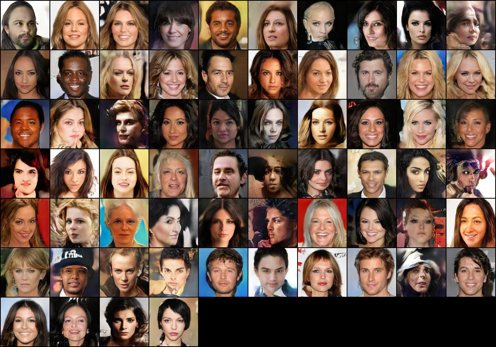

# Progressive Growing of GANs

A pytorch implementation of the popular paper "[Progressive growing of gans for improved quality, stability, and variation](https://arxiv.org/abs/1710.10196)" ([Official tensorflow code](https://github.com/tkarras/progressive_growing_of_gans)).

## Current progress
**Results from a 256-filter model on 128x128:**



## Features

- Fully implemented progressive growing of GANs to reproduce the results on the CelebA-HQ dataset.
- Use of WGAN-GP loss
- Easy-to-use [config files](models/default/config.yml) to change hyperparameters for testing
- Supports both CelebA-HQ and MNIST
- High performance data pre-processing pipeline
- DataParallel support to run on multi-gpu (single node) systems
- Mixed precision support with Apex AMP. We recommend to use optimization level [O1](https://nvidia.github.io/apex/amp.html#o1-mixed-precision-recommended-for-typical-use)
- Loading and saving of checkpoints to stop and resume training


## Requirements

- Pytorch >= 1.0 
- [Apex AMP](https://github.com/NVIDIA/apex.git)
- packages in [requirements](requirements.txt)

To reproduce our results, we recommend you to use a docker environment defined in the [Dockerfile](docker/Dockerfile)

## Training CelebA-HQ

1. Download and pre-process the celebA-HQ dataset. We recommend using the following code: [https://github.com/nperraud/download-celebA-HQ](https://github.com/nperraud/download-celebA-HQ)

2. Pre-process the dataset and save images in different image sizes. By default from 4 to 1024). 

```bash
python3 src/data_tools/generate_datasets.py --source_path data/celebA-HQ --target_path /path/to/extracted/celebA-HQ
```
3. Define the hyperparameters. [Default config file](models/default/config.yml) uses the default hyperparameters from the paper with maximum 256 filters in each convolution.

4. Start training
```bash
python3 src/train.py models/default/config.yml
```

## TODO

- WGAN-GP loss + AC-GAN (as presented in the paper) for class conditional datasets
- CIFAR-10 & LSUN datasets

## Reference implementation
- [Official tensorflow code](https://github.com/tkarras/progressive_growing_of_gans)
- [Naveen Benny's Pytorch implementation](https://github.com/nvnbny/progressive_growing_of_gans)
